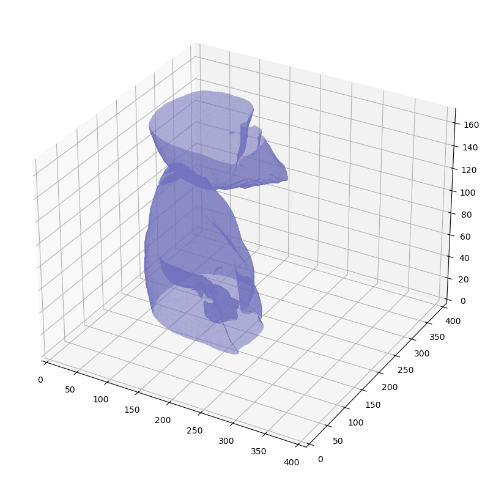

# Medical Exploratory Data Analysis


## Installation
#### Create the conda environment
    conda env create -f environment.yml

## Use
### EDA: 
open the ```eda_analysis.ipynb``` notebook and follow descriptions

<p align="center"> </p> <p align="center"> </p>

### Training:
open the ```train_no_preprocessing.ipynb``` notebook to use dicom images directly

open the ```train_w_preprocessing.ipynb``` notebook to process dicom images, save them and use directly


## Credits
Exploratory Data Analysis:
- [Full Preprocessing Tutorial](https://www.kaggle.com/code/gzuidhof/full-preprocessing-tutorial)
- [Chest CT Scan - Exploratory Analysis](https://www.kaggle.com/code/mattison/chest-ct-scan-exploratory-analysis/notebook)

Network:
- [CT Scan Segmentation](https://github.com/Adamdad/CT-Lung-Segmentation) 


